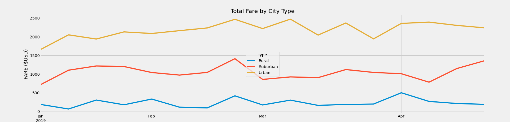

# PyBer_Analysis

## Overview of the analysis
The purpose of this assignment is to visualizse the ride-sharing data over a period of time for each city type.  We needed to understand how many cities the company servies, how many drivers are in each city, the number of rides given and how much fare was collected for the rides.  Once this information is understood, we need to show the relation of these variables between the city types. (Rural, Suburban, Urban). For the challenge a new summary datafram is created with the ride-sharing data to show the fares collected in a 4 month period and to see what the trends are between Rural, Suburban and Urban cities. 

## Results
After running the analysis, I uncovered that there was a total of 2,375 rides given.  Pyber ride-sharing offered services in 66 Urban, 36 Suburban and 18 Rural cities.  Based on the chart below, it's easy to see how much each city type generated in fares collect for the company. Rides in Urban cities generated the most fares while the rural cities generated the least in the 4 month window that was measured.  It's easy to see from the data collected, that Urban cities will produce more in fares due to population density and that there are more Urban cities than there are rural.  Rural cities did collect higher fare amounts per ride. However because there are far fewer rides provided in rural cities, they still bring in the least amount in fares collected.  While Uruban cities collect a little less fare per ride, they make it up in volume of rides serviced. Suburban cities fall right in the middle of it all. Another condiseration to  think about besides population density for thecity types, would be the number of destiantions that people want to vsit within their areas that they would need rides to.  Obviously urban cities will offer more locations that people will want to go visit to while Suburban and rual will have less in their respective areas. 

## Summary
Another condiseration to  think about besides population density for thecity types, would be the number of destiantions that people want to vsit within their areas that they would need rides to.  Obviously urban cities will offer more locations that people will want to go visit to while Suburban and rual will have less in their respective areas. 
